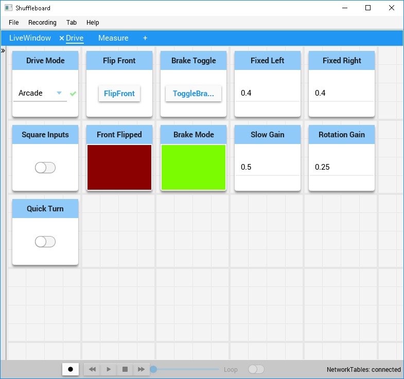

# frc-2019
Basic FIRST Robotics Competition code for language comparison

# Summary

This repository contains a three different implementations of the same basic robot drive code using the command based framework available to FRC teams in Java, C++ and Python. The reasons for this code:

* To get a feel for developing software in each of the 3 languages using the 2019 FRC development environment.
* To compare and contrast the development feel of the three languages.
* To get a rough performance comparison between the three languages for this type of development.
* To have a playground to try out different drive options (tank or arcade, brake or coast, etc).

# Summary Findings

The bottom line is that all three environments have their advantages and disadvantages and your choice should be based on what language your programming team feels most comfortable with. For me, this was Java with FRC team 868 (the TechHOUNDS) as that was the language taught at Carmel High School during my time with the team. When I relocated to North Carolina and started working with  FRC team 5511 (Coretechs Robotics) the team was more familiar with Python.

* The command based framework is virtually identical in all three languages. An understanding of Object Oriented Programming is required.
* C++ feels the slowest for writing code (separate header/source files are a pain and the VS code integration does not feel as nice as Java and Python).
* Java and Python development environment is roughly equal in the speed at which you can code. Java's stricter syntax checking might actually speed up developement as it catches many errors that don't show up in Python until you get a runtime stack trace.
* The simulator available provided by the ropotpy development team is awesome! This is probably the biggest argument for preferring Python over Java.
* Setting up the robotpy developement environment both on your development laptop and the roboRIO involves more work than the Java/C++ setup provided by the wpilib team.
* The C++ and Java languages have many advantages not found in Python (I really miss things like public/private scope, constants, conditional compilation, primitives, braces, semi-colons, etc). In general, I find Python a great choice for quick and dirty applications and scripts that you need to develop fast. I'm just concerned that it won't scale well if your project gets large. 
* Performance measurements have not been done yet (just need some time on the robot and it is hard to find during the build season). I would expect C++ to be the fastest, Java second and then Python. That being said, I'm not sure I expect a lot of difference as I expect most of the run time will be in lower level libraries or waiting for I/O.

# Drive Train Setup

This code assumes a tank style drive train similar to what comes in the kit of parts with the following electronic controls and sensors.

* Three Mini-CIM motors on each side of the drive train.
* Two TalonSRX controllers (one for each side of the drive train). Each serving as the "leader" of the cluster of motors on their respective side of the drive train.
* Four VictorSPX controllers (two on each side) set to "follow mode".
* Two Grayhill encoders one for each side of the drive train.
* The accelerometer built into the roboRIO.
* A NAVx connected to the roboRIO to provide angle information.

You will need to make changes to the drive subsystem according to your hardware. If you don't have encoders or a gyro source, you can take them out and always return 0.

# Drive Controls GUI

If you bring up ShuffleBoard, you should be able to create a driver controls layout similar to the following (you can try loading the drive.json configuration file found under the resources directory).

There are many configurable settings you can experiment with to see how it impacts the usability of your drive train. IMPORTANT:  You must disable and re-enable teleop mode in order for most of the changes you make to settings to take effect.

* Drive mode lets you experiment with the various drive modes found in the DifferentialDrive class.
* All drive modes use both the left and right axis of the game pads. The left Y axis is used both in tank mode (for left side) and other modes for throttle. The right Y axis is only used in tank mode. The right X axis is only used in modes that allow rotation (like arcade).
* You can use the Square Inputs option to change the sensitivity of the moving the joysticks. This does not apply to curvature mode.
* You can use the Quick Turn option to enable turn in place in Curvature mode.
* You can use the Flip Front option to toggle the end of the robot to treat as the front. The left trigger on the gamepad can be used for this as well.
* You can toggle whether the speed controllers are set to Brake or Coast mode to see the impact on driving. However, this only works for speed controllers that support toggling this feature in software.
* You can set the power to apply to the left and right sides when running in Fixed Mode. This can be useful when checking how straight your robot will drive at specific power levels.
* You can set a Slow Gain multipler that will be multiplied to slow down the robot while the right trigger button is held. For example, if you specify 0.75, then all joystick readings will be reduced to 75% of their original value.
* You can specify a rotation gain setting to slow down the rotation rate. At some point I may add a drive mode where this rotation rate slow down is related to the velocity of the robot (typically you don't want much rotation when you are zipping across the field).

# Measuring Tools

This project includes commands to take some measurements related both to the drive train and the code performance.

## Drive Measurements

When you press the Measure button and start the drive measure command, all prior drive measurements will be zeroed out and new values will appear. You will get counts, distance and speed readings displayed from each of the encoders. You will get the relative angle reading from the gyro (relative to when you started the command) as well as the absolute reading from the gyro. You will also get X and Y acceleration values displayed as well as a bump indicator if either of these values exceeds a limit set in the code.

These values can be very useful in verifying that your sensors are behaving correctly.

* Put down two pieces of tape a fixed distance apart and verify that if you push the robot that distance the values measured match.
* Align the bottom and right edge of your robot to lines on the floor. Rotate the robot several times and verify that the relative angle reported matches your rotations.

## Performance Measurements

While working with path finding code in a Python environment, our team was consistently getting the watchdog warning indicating that our code was running too slow. By default command based robots run at 50 Hz. This gives your code 20 msecs of time to execute. If your code takes longer than 20 msecs you will run into issues.

Examination of the source code for each of the frameworks revealed that all three evironments have a loopFunc() that is responsible for executing all of the active commands and verifying that they ran within the alloted time. This function was overloaded in the Python and Java implementations when measuring time. Unfortunately, the C++ framework did not permit overriding this function so its time is measured in the teleopPeriodic() method. This is an unfair advantage and C++ numbers will be skewed because of this.

When you start the performance command on Shuffleboard, it will zero out any prior information and start reporting the time it takes for each pass through your code, the average time and the max time. These values are reported in milliseconds and you want these numbers to remain below 20 (or the value you set your robot to operate at).

# Simulation in robotpy

If you get robotpy installed correctly and add the pygame pip module, you should be able to plug a gamepad into your laptop and drive your robot around on the screen. In the example below I have driven my robot so that it is on the mid-line angled towards the red cargo ship.

Truth be told, I have a hard time getting past my personal bias against using Python for real code. I grew up in a Pascal, C++, PL/1, Java world and tend to prefer stricter languages. I see many of Python's strengths as weaknesses. I like type checking, immutables, scope control, braces and semi-colons. My opinion has been that Python makes it easier create software more quickly. Python also makes it easier to create run time bugs more quickly (little gifts of hidden joy).

However, with a proper IDE set up many of these bugs will be flagged before deployment. 

Even though Python would not be my first choice for developing a command based robot program. Having easy access to the robotpy simulation environment is awesome. This would be the strongest argument for using Python over Java or C++.

While the Java and C++ environments do have a desktop simulation mode. They do not visually display the information or provide a mechanism to drive your robot in simulation mode.
